# 工具--Git详解

## [零、文章目录](https://blog.csdn.net/liyou123456789/article/details/119715435)

## 一、什么是版本控制

### 1、什么是版本控制

版本控制（Revision control）是一种在开发的过程中用于管理我们对文件、目录或工程等内容的修改历史，方便查看更改历史记录，备份以便恢复以前的版本的软件工程技术。

- 实现跨区域多人协同开发
- 追踪和记载一个或者多个文件的历史记录
- 组织和保护你的源代码和文档
- 统计工作量
- 并行开发、提高开发效率
- 跟踪记录整个软件的开发过程
- 减轻开发人员的负担，节省时间，同时降低人为错误

没有进行版本控制或者版本控制本身缺乏正确的流程管理，在软件开发过程中将会引入很多问题，如软件代码的一致性、软件内容的冗余、软件过程的事物性、软件开发过程中的并发性、软件源代码的安全性，以及软件的整合等问题。

### 2、常见的版本控制器

主流的版本控制器有如下这些：

- **Git**
- **SVN**（Subversion）
- **CVS**（Concurrent Versions System）
- **VSS**（Micorosoft Visual SourceSafe）
- **TFS**（Team Foundation Server）
- Visual Studio Online

版本控制产品非常的多（Perforce、Rational ClearCase、RCS（GNU Revision Control System）、Serena Dimention、SVK、BitKeeper、Monotone、Bazaar、Mercurial、SourceGear Vault），现在影响力最大且使用最广泛的是Git与SVN

### 3、版本控制分类

#### （1）本地版本控制

记录文件每次的更新，可以对每个版本做一个快照，或是记录补丁文件，适合个人用，如RCS。


#### （2）集中版本控制

所有的版本数据都保存在服务器上，协同开发者从服务器上同步更新或上传自己的修改


所有的版本数据都存在服务器上，用户的本地只有自己以前所同步的版本，如果不连网的话，用户就看不到历史版本，也无法切换版本验证问题，或在不同分支工作。而且，所有数据都保存在单一的服务器上，有很大的风险这个服务器会损坏，这样就会丢失所有的数据，当然可以定期备份。代表产品：SVN、CVS、VSS

#### （3）分布式版本控制

所有版本信息仓库全部同步到本地的每个用户，这样就可以在本地查看所有版本历史，可以离线在本地提交，只需在连网时push到相应的服务器或其他用户那里。由于每个用户那里保存的都是所有的版本数据，只要有一个用户的设备没有问题就可以恢复所有的数据，但这增加了本地存储空间的占用。

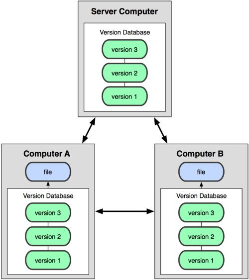

### 4、Git与SVN的区别

SVN是集中式版本控制系统，版本库是集中放在中央服务器的，而工作的时候，用的都是自己的电脑，所以首先要从中央服务器得到最新的版本，然后工作，完成工作后，需要把自己做完的活推送到中央服务器。集中式版本控制系统是必须联网才能工作，对网络带宽要求较高。

Git是分布式版本控制系统，没有中央服务器，每个人的电脑就是一个完整的版本库，工作的时候不需要联网了，因为版本都在自己电脑上。协同的方法是这样的：比如说自己在电脑上改了文件A，其他人也在电脑上改了文件A，这时，你们两之间只需把各自的修改推送给对方，就可以互相看到对方的修改了。Git可以直接看到更新了哪些代码和文件！

## 二、Git安装与配置

### 1、Git历史

Linus在1991年创建了开源的Linux，从此，Linux系统不断发展，已经成为最大的服务器系统软件了。

Linus虽然创建了Linux，但Linux的壮大是靠全世界热心的志愿者参与的，这么多人在世界各地为Linux编写代码，那Linux的代码是如何管理的呢？

事实是，在2002年以前，世界各地的志愿者把源代码文件通过diff的方式发给Linus，然后由Linus本人通过手工方式合并代码！

你也许会想，为什么Linus不把Linux代码放到版本控制系统里呢？不是有CVS、SVN这些免费的版本控制系统吗？因为Linus坚定地反对CVS和SVN，这些集中式的版本控制系统不但速度慢，而且必须联网才能使用。有一些商用的版本控制系统，虽然比CVS、SVN好用，但那是付费的，和Linux的开源精神不符。

不过，到了2002年，Linux系统已经发展了十年了，代码库之大让Linus很难继续通过手工方式管理了，社区的弟兄们也对这种方式表达了强烈不满，于是Linus选择了一个商业的版本控制系统BitKeeper，BitKeeper的东家BitMover公司出于人道主义精神，授权Linux社区免费使用这个版本控制系统。

安定团结的大好局面在2005年就被打破了，原因是Linux社区牛人聚集，不免沾染了一些梁山好汉的江湖习气。开发Samba的Andrew试图破解BitKeeper的协议（这么干的其实也不只他一个），被BitMover公司发现了（监控工作做得不错！），于是BitMover公司怒了，要收回Linux社区的免费使用权。

Linus花了两周时间自己用C写了一个分布式版本控制系统，这就是Git！一个月之内，Linux系统的源码已经由Git管理了！

Git迅速成为最流行的分布式版本控制系统，尤其是2008年，GitHub网站上线了，它为开源项目免费提供Git存储，无数开源项目开始迁移至GitHub，包括jQuery，PHP，Ruby等等。

### 2、Git简介

Git是目前世界上最先进的分布式版本控制系统。

Git是免费、开源的，最初Git是为辅助 Linux 内核开发的，来替代 BitKeeper。

**优点：**

- 适合分布式开发，强调个体。
- 公共服务器压力和数据量都不会太大。
- 速度快、灵活。
- 任意两个开发者之间可以很容易的解决冲突。
- 离线工作。

**缺点：**

- 模式上比SVN更加复杂。
- 不符合常规思维。
- 代码保密性差，一旦开发者把整个库克隆下来就可以完全公开所有代码和版本信息。

**官网**： [https://git-scm.com/](https://git-scm.com/)

**源码：** [https://github.com/git/git/](https://github.com/git/git/)

### 3、Git安装

#### （1）下载Git

打开git官网，下载git对应操作系统的版本。

Linux安装Git：sudo apt-get install git 命令行就可以安装了。

Mac OS安装Git： [https://git-scm.com/download/mac](https://git-scm.com/download/mac)，下载双击.pkg安装

#### （2）安装Git

一直Next默认就好了，如果需要设置就要仔细读一下安装界面上的选项。

#### （3）启动Git

安装成功后在开始菜单中会有Git项，菜单下有3个程序：


- Git Bash：Unix与Linux风格的命令行，使用最多，推荐最多
- Git CMD：Windows风格的命令行
- Git GUI：图形界面的Git，不建议初学者使用，尽量先熟悉常用命令

### 4、Git配置

#### （1）Git配置文件分类

- 系统级的配置文件： /etc/gitconfig：包含了适用于系统所有用户和所有项目的值。(Win：C:\Program Files\Git\mingw64\etc\gitconfig) 
- 全局级的配置文件：~/.gitconfig：只适用于当前登录用户的配置。(Win：C:\Users\Administrator\.gitconfig)  
- 仓库级的配置文件：位于git项目目录中的.git/config：适用于特定git项目的配置。(Win：C:\gitProject) 
- 注意：对于同一配置项，三个配置文件的优先级是 系统级<全局级<仓库级

#### （2）增上改查配置信息

```bash
# 查看配置信息
# --local：仓库级，--global：全局级，--system：系统级
$ git config <--local | --global | --system> -l

# 查看当前生效的配置信息
$ git config -l

# 编辑配置文件
# --local：仓库级，--global：全局级，--system：系统级
$ git config <--local | --global | --system> -e

# 添加配置项
# --local：仓库级，--global：全局级，--system：系统级
$ git config <--local | --global | --system> --add <name> <value>

# 获取配置项
$ git config <--local | --global | --system> --get <name>

# 删除配置项
$ git config <--local | --global | --system> --unset <name>

# 更改Git缓存区的大小
# 如果提交的内容较大，默认缓存较小，提交会失败
# 缓存大小单位：B，例如：524288000（500MB）
$ git config --global http.postBuffer <缓存大小>

# 调用 git status/git diff 命令时以高亮或彩色方式显示改动状态
$ git config --global color.ui true

# 配置可以缓存密码，默认缓存时间15分钟
$ git config --global credential.helper cache

# 配置密码的缓存时间
# 缓存时间单位：秒
$ git config --global credential.helper 'cache --timeout=<缓存时间>'

# 配置长期存储密码
$ git config --global credential.helper store
```

#### （3）设置用户名与邮箱

当你安装Git后首先要做的事情是设置你的用户名称和e-mail地址。这是非常重要的，因为每次Git提交都会使用该信息。它被永远的嵌入到了你的提交中：

```bash
# 配置提交记录中的用户信息
$ git config --global user.name <用户名>
$ git config --global user.email <邮箱地址>
```

只需要做一次这个设置，如果你传递了--global 选项，因为Git将总是会使用该信息来处理你在系统中所做的一切操作。如果你希望在一个特定的项目中使用不同的名称或e-mail地址，你可以在该项目中运行该命令而不要--global选项。 

#### （4）更多配置项

```bash
$ git config --global alias.ci commit   #设置别名别名 ci 是commit的别名
[alias]  
co = checkout  
ci = commit  
st = status  
pl = pull  
ps = push  
dt = difftool  
l = log --stat  
cp = cherry-pick  
ca = commit -a  
b = branch

$ git config core.editor  #文本编辑器
$ git config merge.tool  #差异分析工具
$ git config core.paper "less -N"  #配置显示方式
$ git config color.diff true  #diff颜色配置
$ git config core.filemode false  #忽略修改权限的文件  
```

## 三、Git本地操作

### 1、常用术语

#### （1）仓库（Repository）

受版本控制的所有文件修订历史的共享数据库

#### （2）工作空间（Workspace)

本地硬盘或Unix 用户帐户上编辑的文件副本

#### （3）工作树/区（Working tree）

工作区中包含了仓库的工作文件。您可以修改的内容和提交更改作为新的提交到仓库。

#### （4）暂存区（Staging area）

暂存区是工作区用来提交更改（commit）前可以暂存工作区的变化。

#### （5）索引（Index）

索引是暂存区的另一种术语。

#### （6）签入（Checkin）

将新版本复制回仓库。

#### （7）签出（Checkout）

从仓库中将文件的最新修订版本复制到工作空间。

#### （8）提交（Commit）

对各自文件的工作副本做了更改，并将这些更改提交到仓库。

#### （9）冲突（Conflict）

多人对同一文件的工作副本进行更改，并将这些更改提交到仓库。

#### （10）合并（Merge）

将某分支上的更改联接到此主干或同为主干的另一个分支。

#### （11）分支（Branch）

从主线上分离开的副本，默认分支叫master。

#### （12）锁（Lock）

获得修改文件的专有权限。

#### （13）头（HEAD）

头是一个象征性的参考，最常用以指向当前选择的分支。

#### （14）修订（Revision）

表示代码的一个版本状态。Git通过用SHA1 hash算法表示的ID来标识不同的版本。

#### （15）标记（Tags）

标记指的是某个分支某个特定时间点的状态。通过标记，可以很方便的切换到标记时的状态。

### 2、常用的Linux命令

- cd : 改变目录。
- cd . . 回退到上一个目录，直接cd进入默认目录
- pwd : 显示当前所在的目录路径。
- ls(ll):  都是列出当前目录中的所有文件，只不过ll(两个ll)列出的内容更为详细。
- touch : 新建一个文件 如 touch index.js 就会在当前目录下新建一个index.js文件。
- rm:  删除一个文件, rm index.js 就会把index.js文件删除。
- mkdir:  新建一个目录,就是新建一个文件夹。
- rm -r :  删除一个文件夹, rm -r src 删除src目录
- mv 移动文件, mv index.html src index.html 是我们要移动的文件, src 是目标文件夹,当然, 这样写,必须保证文件和目标文件夹在同一目录下。
- reset 重新初始化终端/清屏。
- clear 清屏。
- history 查看命令历史。
- help 帮助。
- exit 退出。

### 3、常用Git命令

Git本地有三个工作区域：工作目录（Workspace）、暂存区(Stage/Index)、资源库(Repository或Git Directory)。如果在加上远程的git仓库(Remote Directory)就可以分为四个工作区域。文件在这四个区域之间的转换关系如下：


- Workspace：工作区，就是你平时存放项目代码的地方。
- Index / Stage：暂存区，用于临时存放你的改动，事实上它只是一个文件，保存即将提交到文件列表信息。
- Repository：仓库区（或本地仓库），就是安全存放数据的位置，这里面有你提交到所有版本的数据。其中HEAD指向最新放入仓库的版本。
- Remote：远程仓库，托管代码的服务器，可以简单的认为是你项目组中的一台电脑用于远程数据交换本地的三个区域确切的说应该是git仓库中HEAD指向的版本。

日常使用只要记住下图6个命令

#### （1）git add

#### （2）git commit

#### （3）git push

#### （4）git clone

#### （5）git pull

#### （6）git checkout

### 4、GIT仓库操作

创建本地仓库的方法有两种：一种是创建全新的仓库，另一种是克隆远程仓库。

#### （1）创建全新仓库git init

初始化项目所在目录，初始化后会在当前目录下出现一个名为 .git 的目录。

```bash
# 初始化本地仓库，在当前目录下生成 .git 文件夹
$ git init
# 新建一个目录，将其初始化为Git代码库，创建目录与仓库一起完成
$ git init [project-name]
```

#### （2）克隆远程仓库git clone

将远程服务器上的仓库完全镜像一份至本地

```bash
# 默认在当前目录下创建和版本库名相同的文件夹并下载版本到该文件夹下
$ git clone <远程仓库的网址>

# 指定本地仓库的目录
$ git clone <远程仓库的网址> <本地目录>

# -b 指定要克隆的分支，默认是master分支
$ git clone <远程仓库的网址> -b <分支名称> <本地目录>
```

### 5、GIT文件操作

版本控制就是对文件的版本控制，要对文件进行修改、提交等操作，首先要知道文件当前在什么状态，不然可能会提交了现在还不想提交的文件，或者要提交的文件没提交上。GIT不关心文件两个版本之间的具体差别，而是关心文件的整体是否有改变，若文件被改变，在添加提交时就生成文件新版本的快照，而判断文件整体是否改变的方法就是用SHA-1算法计算文件的校验和。

#### （1）查看文件状态git status

- **Untracked**: 未跟踪, 此文件在文件夹中, 但并没有加入到git库, 不参与版本控制. 通过`git add` 状态变为`Staged`。
- **Unmodify**: 文件已经入库, 未修改, 即版本库中的文件快照内容与文件夹中完全一致. 这种类型的文件有两种去处, 如果它被修改, 而变为`Modified`. 如果使用`git rm`移出版本库, 则成为`Untracked`文件
- **Modified**: 文件已修改, 仅仅是修改, 并没有进行其他的操作. 这个文件也有两个去处, 通过`git add`可进入暂存`staged`状态, 使用`git checkout` 则丢弃修改过, 返回到`unmodify`状态, 这个`git checkout`即从库中取出文件, 覆盖当前修改
- **Staged**: 暂存状态. 执行`git commit`则将修改同步到库中, 这时库中的文件和本地文件又变为一致, 文件为`Unmodify`状态. 执行`git reset HEAD filename`取消暂存, 文件状态为`Modified`


```bash
#查看指定文件状态
$ git status [filename]

# 查看本地仓库的状态
$ git status

# 以简短模式查看本地仓库的状态
# 会显示两列，第一列是文件的状态，第二列是对应的文件
# 文件状态：A 新增，M 修改，D 删除，?? 未添加到Git中
$ git status -s
```

#### （2）忽略文件gitignore

有些时候我们不想把某些文件纳入版本控制中，比如数据库文件，临时文件，设计文件等，可以在主目录下建立".gitignore"文件，此文件有如下规则：

- 忽略文件中的空行或以井号（#）开始的行将会被忽略。
- 可以使用Linux通配符。例如：星号（*）代表任意多个字符，问号（？）代表一个字符，方括号（[abc]）代表可选字符范围，大括号（{string1,string2,...}）代表可选的字符串等。
- 如果名称的最前面有一个感叹号（!），表示例外规则，将不被忽略。
- 如果名称的最前面是一个路径分隔符（/），表示要忽略的文件在此目录下，而子目录中的文件不忽略。
- 如果名称的最后面是一个路径分隔符（/），表示要忽略的是此目录下该名称的子目录，而非文件（默认文件或目录都忽略）。

开源忽略文件配置：[https://github.com/github/gitignore](https://github.com/github/gitignore)

#### （3）添加文件与目录git add

将untracked状态的文件添加到暂存区

```bash
# 添加指定文件到暂存区
$ git add [file1] [file2] ...

# 添加指定目录到暂存区，包括子目录
$ git add [dir]

# 添加当前目录的所有文件到暂存区
$ git add .

# 添加所有修改、已删除的文件到暂存区中
$ git add -u [<文件路径>]
$ git add --update [<文件路径>]

# 添加所有修改、已删除、新增的文件到暂存区中，省略 <文件路径> 即为当前目录
$ git add -A [<文件路径>]
$ git add --all [<文件路径>]

# 查看所有修改、已删除但没有提交的文件，进入一个子命令系统
$ git add -i [<文件路径>]
$ git add --interactive [<文件路径>]
```

#### （4）提交git  commit

将暂存区的文件提交到本地仓库

```bash
# 把暂存区中的文件提交到本地仓库，调用文本编辑器输入该次提交的描述信息
$ git commit

# 把暂存区中的文件提交到本地仓库中并添加描述信息
$ git commit -m "<提交的描述信息>"

# 提交暂存区的指定文件到仓库区
$ git commit [file1] [file2] ... -m "<提交的描述信息>"

# 把所有修改、已删除的文件提交到本地仓库中
# 不包括未被版本库跟踪的文件，等同于先调用了 "git add -u"
$ git commit -a

# 提交时显示所有diff信息
$ git commit -v

# 使用一次新的commit，替代上一次提交
# 如果代码没有任何新变化，则用来改写上一次commit的提交信息
$ git commit --amend -m [message]

# 重做上一次commit，并包括指定文件的新变化
$ git commit --amend [file1] [file2] ...
```

#### （5）查看文件差异git diff

查看工作区和暂存区文件的差异

```bash
# 比较当前文件和暂存区中文件的差异，显示没有暂存起来的更改
$ git diff

# 比较暂存区中的文件和上次提交时的差异
$ git diff --cached
$ git diff --staged

# 比较当前文件和上次提交时的差异
$ git diff HEAD

# 查看从指定的版本之后改动的内容
$ git diff <commit ID>

# 比较两个分支之间的差异
$ git diff <分支名称> <分支名称>

# 查看两个分支分开后各自的改动内容
$ git diff <分支名称>...<分支名称>
```

#### （6）签出版本git checkout

检出本地仓库版本到工作区

```bash
# 切换到已存在的指定分支
$ git checkout <分支名称>

#检出branch分支。要完成图中的三个步骤，更新HEAD以指向branch分支，以及用branch  指向的树更新暂存区和工作区。
$ git checkout branch

# 创建并切换到指定的分支，保留所有的提交记录
# 等同于 "git branch" 和 "git checkout" 两个命令合并
$ git checkout -b <分支名称>

# 创建并切换到指定的分支，删除所有的提交记录
$ git checkout --orphan <分支名称>

# 替换掉本地的改动，新增的文件和已经添加到暂存区的内容不受影响
$ git checkout <文件路径>

#牵出当前分支。
$ git checkout

#同上
$ git checkout HEAD

#用暂存区中filename文件来覆盖工作区中的filename文件。相当于取消自上次执行git add filename以来（如果执行过）的本地修改。
$ git checkout -- filename

#维持HEAD的指向不变。用branch所指向的提交中filename替换暂存区和工作区中相   应的文件。注意会将暂存区和工作区中的filename文件直接覆盖。
$ git checkout branch -- filename

#注意git checkout 命令后的参数为一个点（“.”）。这条命令最危险！会取消所有本地的  #修改（相对于暂存区）。相当于用暂存区的所有文件直接覆盖本地文件，不给用户任何确认的机会！
$ git checkout -- . 或写作 git checkout .

#如果不加commit_id，那么git checkout -- file_name 表示恢复文件到本地版本库中最新的状态。
$ git checkout commit_id -- file_name
```

#### （7）日志与历史git log

你看到的一大串类似`1094adb...`的是`commit id`（版本号），和SVN不一样，Git的`commit id`不是1，2，3……递增的数字，而是一个SHA1计算出来的一个非常大的数字，用十六进制表示，而且你看到的`commit id`和我的肯定不一样，以你自己的为准。为什么`commit id`需要用这么一大串数字表示呢？因为Git是分布式的版本控制系统，后面我们还要研究多人在同一个版本库里工作，如果大家都用1，2，3……作为版本号，那肯定就冲突了。

```bash
# 打印所有的提交记录
$ git log

# 打印从第一次提交到指定的提交的记录
$ git log <commit ID>

# 打印指定行数的的最新提交的记录
$ git log -<指定的行数>

#以图形化的方式显示提交历史的关系，这就可以方便地查看提交历史的分支信息，当然是控制台用字符画出来的图形
$ git log --graph
```

#### （8）所有日志与历史git reflog

```bash
#记录这个仓库中所有的分支的所有更新记录，包括已经撤销的更新
$ git reflog
```

#### （9）查看文件列表git ls-files

查看指定状态的文件列表

```bash
#查看指定状态的文件
$ git ls-files [-z] [-t] [-v] (--[cached|deleted|others|ignored|stage|unmerged|killed|modified])* (-[c|d|o|i|s|u|k|m])*

#默认查看所有缓存的文件
$ git ls-files 

#查看未被跟踪的文件
$ git ls-files -o

#查看被修改的文件
$ git ls-files -modified

#查看暂存区中文件明细
$ git ls-files -s
```

#### （10）删除文件git rm

```bash
#删除工作区未跟踪文件
$ rm  <file>

#移除工作区所有未跟踪文件
#一般会加上参数-df，-d表示包含目录，-f表示强制清除。
$ git clean -df

#直接从暂存区删除文件，工作区则不做出改变
$ git rm --cached <file>

#不但从暂存区中删除，同时删除工作区文件，-f 强制删除
$ git rm -f <file>
```

#### （11）撤销修改git reset

首先，Git必须知道当前版本是哪个版本，在Git中，用`HEAD`表示当前版本，上一个版本就是`HEAD^`，上上一个版本就是`HEAD^^`，当然往上100个版本写100个`^`比较容易数不过来，所以写成`HEAD~100`。

```bash
# 重置暂存区，但文件不受影响
# 相当于将用 "git add" 命令更新到暂存区的内容撤出暂存区，可以指定文件
# 没有指定 commit ID 则默认为当前 HEAD
$ git reset [<文件路径>]
$ git reset --mixed [<文件路径>]

# 将 HEAD 的指向改变，撤销到指定的提交记录，文件未修改
$ git reset <commit ID>
$ git reset --mixed <commit ID>

# 将 HEAD 的指向改变，撤销到指定的提交记录，文件未修改
# 相当于调用 "git reset --mixed" 命令后又做了一次 "git add"
$ git reset --soft <commit ID>

# 将 HEAD 的指向改变，撤销到指定的提交记录，文件也修改了
$ git reset --hard <commit ID>

#用暂存区中filename文件来覆盖工作区中的filename文件。相当于取消自上次执行git add filename以来（如果执行过）的本地修改。
$ git checkout -- filename

# 生成一个新的提交来撤销某次提交
$ git revert <commit ID>
```

#### （12）重命名文件git mv

-F：强制重命名或移动文件

-k：跳过会导致错误情况的移动或重命名操作。

-n：什么也没做，只显示会发生什么

-v：移动文件时报告文件的名称。

```bash
# 重命名指定的文件或者文件夹
$ git mv [-v] [-f] [-n] [-k] <源文件/文件夹> <目标文件/文件夹>
```

### 6、帮助与代码统计

#### （1）帮助文档

官网帮助文档：[https://git-scm.com/docs](https://git-scm.com/docs)

离线帮助文档：完整的安装了Git后有一个官方帮助，这是最权威的资料，输入命令自动打开html帮助文档

```bash
$ git 命令 --help 
```

#### （2）信息查看与统计命令

```bash
#统计某人的代码提交量，包括增加，删除：
git log --author="$(git config --get user.name)" --pretty=tformat: --numstat | gawk '{ add += $1 ; subs += $2 ; loc += $1 - $2 } END { printf 
"added lines: %s removed lines : %s total lines: %s\n",add,subs,loc }' -

#仓库提交者排名前 5（如果看全部，去掉 head 管道即可）：
git log --pretty='%aN' | sort | uniq -c | sort -k1 -n -r | head -n 5

#仓库提交者（邮箱）排名前 5：这个统计可能不会太准，因为很多人有不同的邮箱，但会使用相同的名字
git log --pretty=format:%ae | gawk -- '{ ++c[$0]; } END { for(cc in c) printf "%5d %s\n",c[cc],cc; }' | sort -u -n -r | head -n 5 

#贡献者统计：
git log --pretty='%aN' | sort -u | wc -l

#提交数统计：
git log --oneline | wc -l 

# 显示有变更的文件
$ git status

# 显示当前分支的版本历史
$ git log

# 显示commit历史，以及每次commit发生变更的文件
$ git log --stat

# 搜索提交历史，根据关键词
$ git log -S [keyword]

# 显示某个commit之后的所有变动，每个commit占据一行
$ git log [tag] HEAD --pretty=format:%s

# 显示某个commit之后的所有变动，其"提交说明"必须符合搜索条件
$ git log [tag] HEAD --grep feature

# 显示某个文件的版本历史，包括文件改名
$ git log --follow [file]
$ git whatchanged [file]

# 显示指定文件相关的每一次diff
$ git log -p [file]

# 显示过去5次提交
$ git log -5 --pretty --oneline

# 显示所有提交过的用户，按提交次数排序
$ git shortlog -sn

# 显示指定文件是什么人在什么时间修改过
$ git blame [file]

# 显示暂存区和工作区的差异
$ git diff

# 显示暂存区和上一个commit的差异
$ git diff --cached [file]

# 显示工作区与当前分支最新commit之间的差异
$ git diff HEAD

# 显示两次提交之间的差异
$ git diff [first-branch]...[second-branch]

# 显示今天你写了多少行代码
$ git diff --shortstat "@{0 day ago}"

# 显示某次提交的元数据和内容变化
$ git show [commit]

# 显示某次提交发生变化的文件
$ git show --name-only [commit]

# 显示某次提交时，某个文件的内容
$ git show [commit]:[filename]

# 显示当前分支的最近几次提交
$ git reflog
```

## 四、GIT标签操作

### 1、标签简介

- tag是git版本库的一个标记，指向某个commit的指针。tag主要用于发布版本的管理，一个版本发布之后，我们可以为git打上 v.1.0.1 v.1.0.2 ...这样的标签，比commitid更易读和记忆。
- tag感觉跟branch有点相似，但是本质上和分工上是不同的，tag 对应某次commit，是一个点，是不可移动的。branch 对应一系列commit，是很多点连成的一根线，有一个HEAD 指针，是可以依靠 HEAD 指针移动的。
  所以，两者的区别决定了使用方式，改动代码用 branch，不改动只查看用 tag。
- tag 和 branch 的相互配合使用，有时候起到非常方便的效果，例如：已经发布了 v1.0 v2.0 v3.0 三个版本，这个时候，我突然想不改现有代码的前提下，在 v2.0 的基础上加个新功能，作为 v4.0 发布。就可以检出 v2.0 的代码作为一个 branch ，然后作为开发分支。

### 2、查看标签

```bash
# 查看所有的标签
$ git tag

# 查看标签的信息
$ git show <标签名称>
```

### 3、创建标签

```bash
# 添加轻量标签，指向提交对象的引用，可以指定之前的提交记录
$ git tag <标签名称> [<commit ID>]

# 添加带有描述信息的附注标签，可以指定之前的提交记录
$ git tag -a <标签名称> -m <标签描述信息> [<commit ID>]
```

### 4、操作标签

```bash
# 切换到指定的标签
$ git checkout <标签名称>

# 删除指定的标签
$ git tag -d <标签名称>

# 将指定的标签提交到远程仓库
$ git push <远程仓库的别名> <标签名称>

# 将本地所有的标签全部提交到远程仓库
$ git push <远程仓库的别名> –tags
```

## 五、GIT分支操作

### 1、分支原理

假设你准备开发一个新功能，但是需要两周才能完成，第一周你写了50%的代码，如果立刻提交，由于代码还没写完，不完整的代码库会导致别人不能干活了。如果等代码全部写完再一次提交，又存在丢失每天进度的巨大风险。

现在有了分支，就不用怕了。你创建了一个属于你自己的分支，别人看不到，还继续在原来的分支上正常工作，而你在自己的分支上干活，想提交就提交，直到开发完毕后，再一次性合并到原来的分支上，这样，既安全，又不影响别人工作。

每次提交，Git都把它们串成一条时间线，这条时间线就是一个分支。只有一条时间线时，这个分支叫主分支，即master分支。HEAD严格来说不是指向提交，而是指向master，master才是指向提交的，所以，HEAD指向的就是当前分支。每次提交，master分支都会向前移动一步，这样，随着你不断提交，master分支的线也越来越长。


当我们创建新的分支，例如`dev`时，Git新建了一个指针叫`dev`，指向`master`相同的提交，再把`HEAD`指向`dev`，就表示当前分支在`dev`上：


Git创建一个分支很快，因为除了增加一个`dev`指针，改改`HEAD`的指向，工作区的文件都没有任何变化！不过，从现在开始，对工作区的修改和提交就是针对`dev`分支了，比如新提交一次后，`dev`指针往前移动一步，而`master`指针不变：


假如我们在`dev`上的工作完成了，就可以把`dev`合并到`master`上。Git怎么合并呢？最简单的方法，就是直接把`master`指向`dev`的当前提交，就完成了合并：


所以Git合并分支也很快！就改改指针，工作区内容也不变！合并完分支后，甚至可以删除`dev`分支。删除`dev`分支就是把`dev`指针给删掉，删掉后，我们就剩下了一条`master`分支：


### 2、分支命令

#### （1）查看分支git branch

```bash
#列出所有本地分支使用
$ git branch

# 列出本地的所有分支并显示最后一次提交，当前所在分支以 "*" 标出
$ git branch -v

#列表所有远程分支使用
$ git branch -r

#列出所有本地分支和远程分支使用
$ git branch -a

#查看分支合并图
$ git log --graph
```

#### （2）新建分支git branch

```bash
# 创建新分支，新的分支基于上一次提交建立
$ git branch <分支名称>

# 新建一个分支，指向指定commit使用命令
$ git branch <分支名称> [commit id]

# 新建一个分支，与指定的远程分支建立追踪关系使用命令
$ git branch --track <分支名称> <远程分支名称>
```

#### （3）修改分支名称git branch

```bash
# 修改分支名称
# 如果不指定原分支名称则为当前所在分支
$ git branch -m [<原分支名称>] <新的分支名称>
# 强制修改分支名称
$ git branch -M [<原分支名称>] <新的分支名称>
```

#### （4）删除分支git branch

```bash
# 删除指定的本地分支
$ git branch -d <分支名称>

# 强制删除指定的本地分支
$ git branch -D <分支名称>

# 删除远程分支
$ git push origin --delete [branch-name]

#-d表示删除分支。分支必须完全合并在其上游分支，或者在HEAD上没有设置上游
#-r表示远程的意思remotes，如果-dr则表示删除远程分支
$ git branch -dr [remote/branch]
```

#### （5）切换分支git checkout

```bash
# 切换到已存在的指定分支
$ git checkout <分支名称>

# 切换到上一分支
$ git checkout -

# 创建并切换到指定的分支，保留所有的提交记录
# 等同于 "git branch" 和 "git checkout" 两个命令合并
$ git checkout -b <分支名称>

# 创建并切换到指定的分支，删除所有的提交记录
$ git checkout --orphan <分支名称>

# 替换掉本地的改动，新增的文件和已经添加到暂存区的内容不受影响
$ git checkout <文件路径>
```

#### （6）分支合并git merge

```bash
# 把指定的分支合并到当前所在的分支下
$ git merge <分支名称>
```

#### （7）分支合并git cherry-pick

把已经提交的记录合并到当前分支

```bash
# 把已经提交的记录合并到当前分支
$ git cherry-pick <commit ID>
```

#### （8）解决冲突

- 如果同一个文件在合并分支时都被修改了则会引起冲突，解决的办法是我们可以修改冲突文件后重新添加提交


### 3、分支策略

- `master`分支应该是非常稳定的，也就是仅用来发布新版本，平时不能在上面干活；
- 干活都在`dev`分支上，也就是说，`dev`分支是不稳定的，到某个时候，比如1.0版本发布时，再把`dev`分支合并到`master`上，在`master`分支发布1.0版本；
- 项目成员每个人都在`dev`分支上干活，每个人都有自己的分支，时不时地往`dev`分支上合并。

## 六、Git远程仓库

Git是分布式版本控制系统，同一个Git仓库，可以分布到不同的机器上，但开发参与者必须在同一个网络中，且必须有一个项目的原始版本，通常的办法是让一台电脑充当服务器的角色，每天24小时开机，其他每个人都从这个服务器仓库克隆一份到自己的电脑上，并且各自把各自的提交推送到服务器仓库里，也从服务器仓库中拉取别人的提交。完全可以自己搭建一台运行Git的服务器但现在更适合的做法是使用免费的托管平台。

同时相较于传统的代码都是管理到本机或者内网。 一旦本机或者内网机器出问题，代码可能会丢失，使用远端代码仓库将永远存在一个备份。同时也免去了搭建本地代码版本控制服务的繁琐。 云计算时代 Git 以其强大的分支和克隆功能，更加方便了开发者远程协作。

### 1、常见托管平台

Git代码托管平台，首先推荐的是GitHub，好多好的开源项目都来自GitHub，但是GitHub有时候访问比较卡，如果你做的是一个开源项目，可以首选GitHub。

#### （1）GitHub

地址：[https://github.com/](https://github.com/)

#### （2）Gitlab

地址：[https://about.gitlab.com/](https://about.gitlab.com/)

#### （3）Bitbucket

地址：[https://bitbucket.org/](https://bitbucket.org/)

#### （4）gitee

地址：https://gitee.com/

#### （5）coding.net

地址： [https://coding.net/](https://coding.net/)

### 2、远程仓库准备

本地仓库和远程仓库交互需要加密传输数据，所以需要在本地生成SSH公钥和私钥，远程仓库配置公钥。

#### （1）检查本地是否有SSH Key存在

```bash
$ ls -al ~/.ssh
```

#### （2）生成SSH Key

```bash
#your_email@example.com 为你在 GitHub或者Gitee注册时的邮箱
$ ssh-keygen -t rsa -C "your_email@example.com"
```

公钥和私钥生成会在文件夹C:\Users\Administrator\.ssh里面，id_rsa是私钥内容，id_rsa.pub是公钥内容，生成的时候会提示输入密码直接回车即可，否则后续每次提交都需要数一遍密码确认。

#### （3）配置本地库关联多个远程库 同一个SSH

```bash
# 方法一 两个库两个不同的别名
git remote add origin <远程仓库地址1>
git remote add newku <远程仓库地址2>

# 方法二 两个库同一个别名，两个url
git remote add origin <远程仓库地址1>
git remote set-url --add oginin <远程仓库地址2>
```

#### （4）配置本地库关联多个远程库 不同SSH

工作用到公司的git repo，自己在github、coding有自己的repo，但是是在同一台笔记本上连接一个ssh证书对应一个仓库，在做相应的配置即可以公司、GitHub、Coding三个repo为例

> 创建三份ssh证书

根据每个repo用到的email生成ssh证书

```bash
ssh-keygen -t rsa -b 4096 -C "your_email@example.com"
```

 根据不同的repo进行命名，后面需要给每个repo配置证书

```bash
Enter a file in which to save the key (/Users/you/.ssh/id_rsa): [XXXXXX（每个repo对应的ssh名称）]
```

输入密码，一般都是直接回车，每次都是免密

```bash
Enter passphrase (empty for no passphrase): [Type a passphrase]
Enter same passphrase again: [Type passphrase again]
```

重复3次，生成3个ssh证书，分别为： id_rsa_work 、id_rsa_github、id_rsa_coding，位于～/.ssh 目录下

> 配置repo相应的ssh证书

在~/.ssh 目录下新建 config文件 touch ~/.ssh/config，填写内容如下

```bash
#dhms 
host git-server
user liyou
hostname lan.work.cloud
port 29418
identityfile ~/.ssh/id_rsa_work
KexAlgorithms XXXXXXXXXXXXXXXXXX

#github
Host github.com
User liyou
HostName github.com
IdentityFile ~/.ssh/id_rsa_github

#coding
Host git.coding.net
User liyou
HostName git.coding.net
PreferredAuthentications publickey
IdentityFile ~/.ssh/id_rsa_coding
```

> 最后远程库填写对应的SSH公钥

将`~/.ssh` 目录下的 id_rsa_work.pub 、id_rsa_github.pub、id_rsa_coding.pub中的内容填写到相应的repo的ssh配置中

> 原理分析

ssh 客户端是通过类似 git@github.com:githubUserName/repName.git 的地址来识别使用本地的哪个私钥的，地址中的 User 是@前面的git， Host 是@后面的github.com。

如果所有账号的 User 和 Host 都为 git 和 github.com，那么就只能使用一个私钥。所以要对User 和 Host 进行配置，让每个账号使用自己的 Host，每个 Host 的域名做 CNAME 解析到 github.com，如上面配置中的Host second.github.com。

配置了别名之后，新的地址就是git@second.github.com:githubUserName/repName.git（在添加远程仓库时使用）。这样 ssh 在连接时就可以区分不同的账号了。填写ssh证书内容到相应的repo

#### （5）在远程库里面配置公钥

以gitee为例，找到设置，找到SSH，将公钥配置进去即可

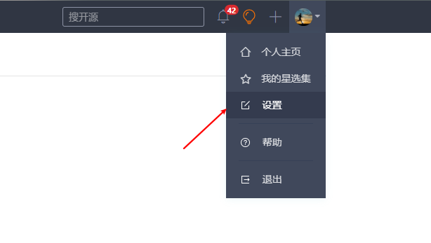


#### （6）创建仓库

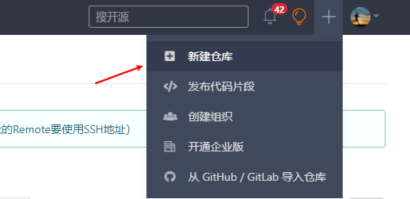

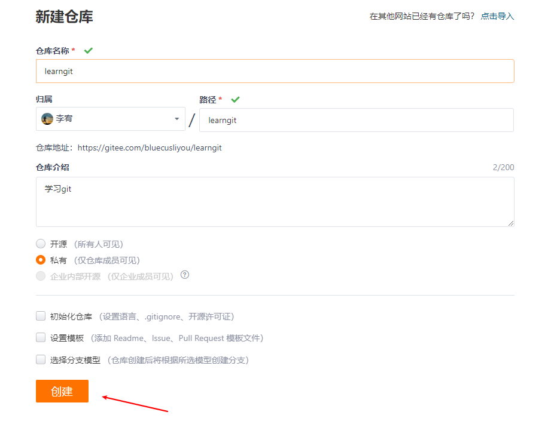

### 3、远程仓库操作命令

申请到了Git远程仓库的帐号并创建了一个空的远程仓库现在我们就可以结合本地的仓库与远程仓库一起协同工作了，模拟多人协同开发，这里我们全部使用命令完成。

#### （1）克隆仓库git clone

```bash
# 默认在当前目录下创建和版本库名相同的文件夹并下载版本到该文件夹下
$ git clone <远程仓库的网址>

# 指定本地仓库的目录
$ git clone <远程仓库的网址> <本地目录>

# -b 指定要克隆的分支，默认是master分支
$ git clone <远程仓库的网址> -b <分支名称> <本地目录>

# git clone支持多种协议，除了HTTP(s)以外，还支持SSH、Git、本地文件协议等
$ git clone http[s]://example.com/path/to/repo.git/
$ git clone ssh://example.com/path/to/repo.git/
$ git clone git://example.com/path/to/repo.git/
$ git clone /opt/git/project.git 
$ git clone file:///opt/git/project.git
$ git clone ftp[s]://example.com/path/to/repo.git/
$ git clone rsync://example.com/path/to/repo.git/

# 克隆版本库的时候，所使用的远程主机自动被Git命名为origin。如果想用其他的别名，需要用git clone命令的-o选项指定。
$ git clone -o 主机名 <远程仓库的网址>
```

#### （2）操作远程仓库别名git remote

为了便于管理，Git要求每个远程仓库都必须指定一个别名。`git remote`命令就用于管理这些别名和仓库之间的关系。

```bash
# 列出已经存在的远程仓库
$ git remote

# 列出远程仓库的详细信息，在别名后面列出URL地址
$ git remote -v
$ git remote --verbose

# 添加远程仓库
$ git remote add <远程仓库的别名> <远程仓库的URL地址>

# 修改远程仓库的别名
$ git remote rename <原远程仓库的别名> <新的别名>

# 删除指定名称的远程仓库
$ git remote remove <远程仓库的别名>

# 修改远程仓库的 URL 地址
$ git remote set-url <远程仓库的别名> <新的远程仓库URL地址>

# 删除远程仓库别名
$ git remote rm <主机名>

# 查看该主机的详细信息
$ git remote show <主机名>
```

#### （3）获取远程仓库到本地git fetch

一旦远程主机的版本库有了更新，需要将这些更新取回本地，这时就要用到`git fetch`命令。

`git fetch`命令通常用来查看其他人的进程，因为它取回的代码对你本地的开发代码没有影响。

所取回的更新，在本地主机上要用"远程主机名/分支名"的形式读取。比如`origin`主机的`master`，就要用`origin/master`读取。和你本地的`master`是两个独立的分支。

```bash
# 将远程仓库所有分支的最新版本全部取回到本地
$ git fetch <远程仓库的别名>

# 将远程仓库指定分支的最新版本取回到本地
$ git fetch <远程主机名> <支名>
```

#### （4）获取远程仓库到本地且合并git pull

取回远程主机某个分支的更新，再与本地的指定分支合并。

首先会执行 `git fetch`，然后执行 `git merge`，把获取的分支的 HEAD 合并到当前分支。

```bash
# 如果远程分支是与当前分支合并，则冒号后面的部分可以省略
$ git pull <远程主机别名> <远程分支名>:<本地分支名>
```

#### （5）本地更新推送到远程仓库git push

`git push`命令用于将本地分支的更新，推送到远程主机。

```bash
# 把本地仓库的分支推送到远程仓库的指定分支
$ git push <远程仓库的别名> <本地分支名>:<远程分支名>

# 删除指定的远程仓库的分支
$ git push <远程仓库的别名> :<远程分支名>
$ git push <远程仓库的别名> --delete <远程分支名>
```

## 七、客户端配置

### 1、VSCode

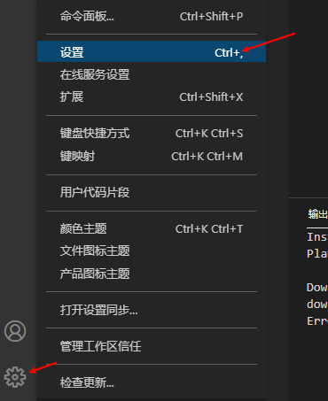


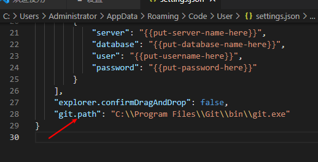

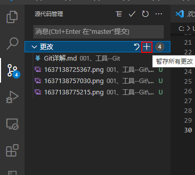


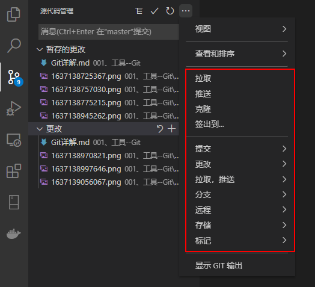

### 2、Visual Studio 2022

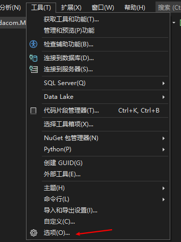


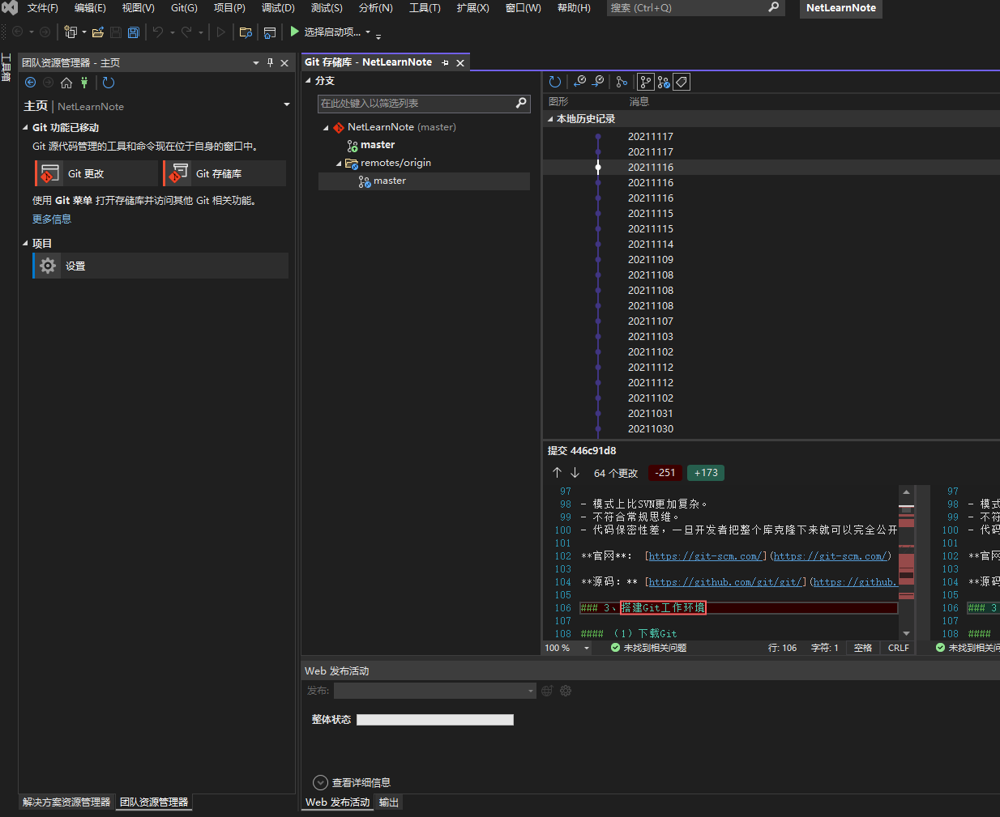

### 3、TortoiseGit

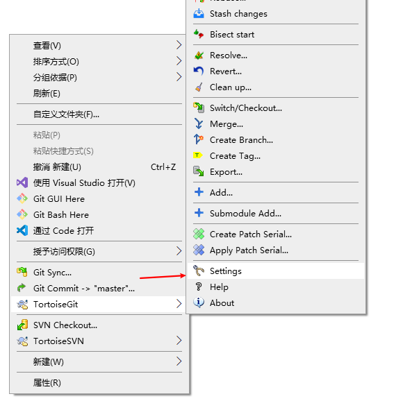

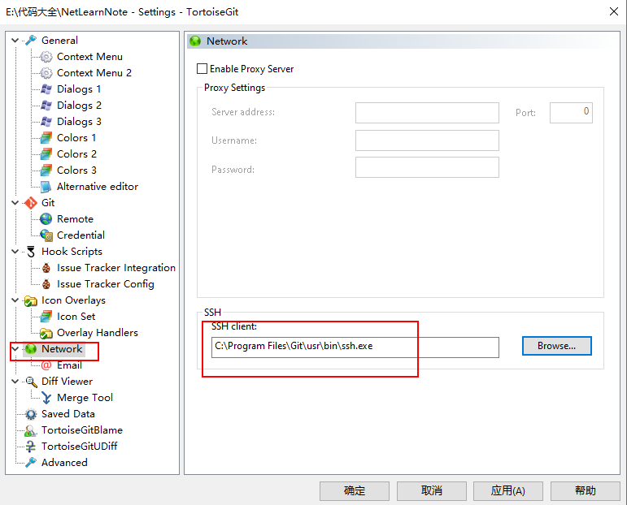

## 八、github使用

### 1、项目搜索技巧

#### （1）根据star，fork数筛选

```bash
# 1、大于等于
# 语法： 关键字 stars:>= 数量 forks:>=数量 
# 可单独搜索，也可组合搜索，中间用空格隔开，是&（且）的关系。
# 搜索springboot有关star数>=5000的内容 
springboot stars:>=5000 
# 搜索springboot 的star>=5000，且fork数>=5000的内容
springboot stars:>=5000 forks:>=5000

# 2、范围查询
#  语法： 关键字 stars:范围1..范围2
#  搜索star数在 4000到500的springboot相关内容
springboot stars:4000..5000
```

#### （2）关键字 in

```bash
# 语法 ：关键字 in:
# 查找名称中包含netty的内容
netty in:name
# 逗号分隔，是 || (或)的关系，指的是查询名称，或者描述中包含netty的内容
netty in:name,description
```

#### （3）awesome + 关键字

一般是指的学习，书籍，工具类，插件类相关的系列的集合。可以有效节约时间，找到别人收集好的内容。

awesome 指的是了不起的，碉堡了。

```bash
awesome springboot
```

#### （4）搜索某个语言，某个地区的大佬

```bash
location:Beijing language:java 
```

#### （5）常用快捷键

- ? ：可调出快捷键页面
- t ：以列表形式平铺展开，方便查看
- s ：以列表形式平铺展开，方便查看

#### （6）实现某行，某块代码高亮

代码url后面加上#LXXX，代码行高亮

```bash
https://github.com/unofficial-openjdk/openjdk/blob/jdk/jdk/test/jdk/sun/misc/GetSunMiscUnsafe.java#L36-L40
```

#### （7）user

查询某位用户的相关内容，比如某位大佬

```bash
语法：user:名称
user:sunkaixuan
```

#### （8）Trending找到一些有潜力的项目

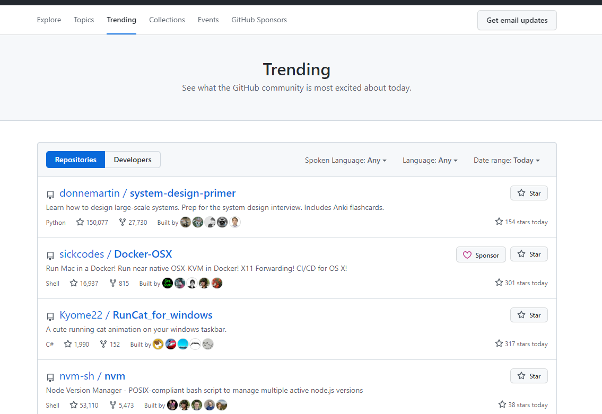

### 2、watch、star 、fork

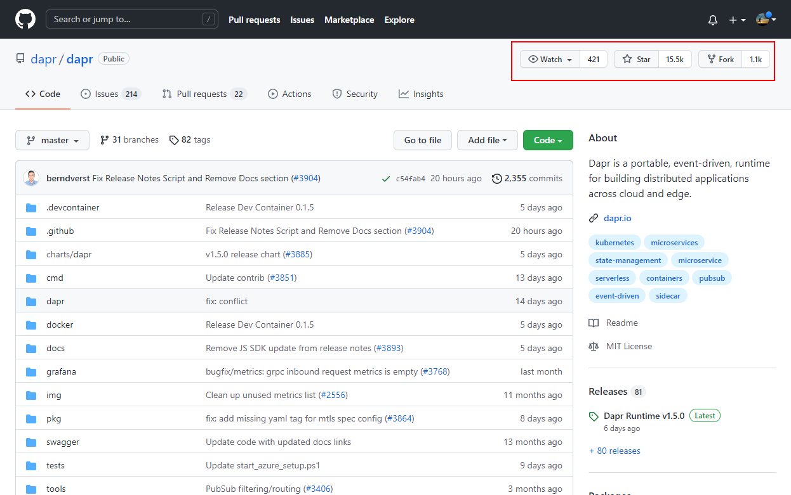

#### （1）watch

Watch可以理解为关注的意思，默认情况下是Not watching，当选择Watch后，你会收到这个GitHub项目的所有动态。比如：有人发起pull request或者issue等。

#### （2）star

Star（星星）可以理解为朋友圈点赞，遇到喜欢的项目可以Star一下，表示对这个项目支持和赞许。你Star过的项目可以通过个人头像下的Your stars查看。

你的账号下面有your stars可以查看你star的项目。

#### （3）fork

某个GitHub项目可能存在bug，或者你想帮助原项目优化一下，这时候你可以使用Fork功能。Fork一下可以拷贝别人的原项目，然后你在原项目的基础上优化和完善，然后再发起pull request给原项目作者，作者接受，你的修改和优化就会进入到作者的项目中。

#### （4）技巧

watch、star 、fork旁边的数字点进去可以看到哪些人watch、star 、fork了这个项目。

### 3、加速下载项目

可以从gitee导入github的网站，然后再当下来


## 九、搭建gitlab服务器

服务器内存至少4G，否则无法运行。

### 1、服务器安装docker环境 centos8.2

```bash
#1.卸载旧版本 
sudo yum remove docker \
                  docker-client \
                  docker-client-latest \
                  docker-common \
                  docker-latest \
                  docker-latest-logrotate \
                  docker-logrotate \
                  docker-engine

#2.需要的安装包 
sudo yum install -y yum-utils

#3.设置镜像的仓库 
sudo yum-config-manager \
    --add-repo \
    https://download.docker.com/linux/centos/docker-ce.repo 
#默认是从国外的，不推荐，国内访问可能会失败
#推荐使用国内的
sudo yum-config-manager \
    --add-repo \
    http://mirrors.aliyun.com/docker-ce/linux/centos/docker-ce.repo

#更新yum软件包索引 
sudo yum makecache

#4.安装docker相关的 docker-ce 社区版 而ee是企业版 
sudo yum install docker-ce docker-ce-cli containerd.io 

#6. 使用docker version查看是否按照成功 
docker version

#7. 启动Docker服务
sudo service docker restart

#8. 测试运行
docker run hello-world

#9.查看一下下载的镜像
docker images

#10.查看一下容器
docker ps -a
```

### 2、为gitlab的创建数据目录

```bash
[root@bluecusliyou ~]# sudo mkdir -p /data/gitlab
```

### 3、docker运行启动gitlab

```bash
$ docker run -d  -p 443:443 -p 80:80 -p 222:22 --name gitlab --restart always -v /data/gitlab/config:/etc/gitlab -v /data/gitlab/logs:/var/log/gitlab -v /data/gitlab/data:/var/opt/gitlab gitlab/gitlab-ce
# -d：后台运行
# -p：将容器内部端口向外映射
# --name：命名容器名称
# -v：将容器内数据文件夹或者日志、配置等文件夹挂载到宿主机指定目录
```

### 4、配置gitlab访问地址

按上面的方式，gitlab容器运行没问题，但在gitlab上创建项目的时候，生成项目的URL访问地址是按容器的hostname来生成的，也就是容器的id。作为gitlab服务器，我们需要一个固定的URL访问地址，于是需要配置gitlab.rb（宿主机路径：/data/gitlab/config/gitlab.rb）

```bash
# gitlab.rb文件内容默认全是注释
$ vim /data/gitlab/config/gitlab.rb

# 配置http协议所使用的访问地址,不加端口号默认为80
external_url 'http://服务器IP'

# 配置ssh协议所使用的访问地址和端口
gitlab_rails['gitlab_ssh_host'] = '服务器IP'
gitlab_rails['gitlab_shell_ssh_port'] = 222 # 此端口是run时22端口映射的222端口
:wq #保存配置文件并退出

# 重启容器实例
$ docker restart gitlab
```

### 5、配置管理员密码

```bash
# 进入容器
$ docker exec -it gitlab /bin/bash

# 进入gitlab，很慢，大概一分钟，莫着急
$ gitlab-rails console -e production

# 来查找与切换账号（User.all 可以查看所有用户）
u=User.where(id:1).first 

# 设置密码为12345678(这里的密码看自己喜欢)：
u.password='12345678'

# 再次确认密码
u.password_confirmation='12345678' 

# 进行保存（切记切记 后面的 !）
u.save!

# 退出console
exit

# 退出容器
exit
```

### 6、gitlab登录页面

root/12345678登录


## 十、开源协议

世界上的开源许可证（Open Source License）大概有上百种，今天我们来介绍下几种我们常见的开源协议。大致有GPL、BSD、MIT、Mozilla、Apache和LGPL等。


### 1、Apache License

Apache License（Apache许可证），是Apache软件基金会发布的一个自由软件许可证。

Apache Licence是著名的非盈利开源组织Apache采用的协议。该协议和BSD类似，同样鼓励代码共享和最终原作者的著作权，同样允许源代码修改和再发布。但是也需要遵循以下条件：

- 需要给代码的用户一份Apache Licence。
- 如果修改了代码，需要再被修改的文件中说明。
- 在衍生的代码中（修改和有源代码衍生的代码中）需要带有原来代码中的协议，商标，专利声明和其他原来作者规定需要包含的说明。
- 如果再发布的产品中包含一个Notice文件，则在Notice文件中需要带有Apache Licence。你可以再Notice中增加自己的许可，但是不可以表现为对Apache Licence构成更改。
- Apache Licence也是对商业应用友好的许可。使用者也可以再需要的时候修改代码来满足并作为开源或商业产品发布/销售。

使用这个协议的好处是:

- 永久权利 一旦被授权，永久拥有。
- 全球范围的权利 在一个国家获得授权，适用于所有国家。假如你在美国，许可是从印度授权的，也没有问题。
- 授权免费 无版税， 前期、后期均无任何费用。
- 授权无排他性 任何人都可以获得授权
- 授权不可撤消 一旦获得授权，没有任何人可以取消。比如，你基于该产品代码开发了衍生产品，你不用担心会在某一天被禁止使用该代码

### 2、BSD

BSD是"Berkeley Software Distribution"的缩写，意思是"伯克利软件发行版"。

BSD开源协议：是一个给于使用者很大自由的协议。可以自由的使用，修改源代码，也可以将修改后的代码作为开源或者专有软件再发布。 当你发布使用了BSD协议的代码，或则以BSD协议代码为基础做二次开发自己的产品时，需要满足三个条件：

- 1． 如果再发布的产品中包含源代码，则在源代码中必须带有原来代码中的BSD协议。
- 2． 如果再发布的只是二进制类库/软件，则需要在类库/软件的文档和版权声明中包含原来代码中的BSD协议。
- 3． 不可以用开源代码的作者/机构名字和原来产品的名字做市场推广。

BSD代码鼓励代码共享，但需要尊重代码作者的著作权。BSD由于允许使用者修改和重新发布代码，也允许使用或在BSD代码上开发商业软件发布和销售，因此是对商业集成很友好的协议。而很多的公司企业在选用开源产品的时候都首选BSD协议，因为可以完全控制这些第三方的代码，在必要的时候可以修改或者二次开发。

### 3、GPL

GPL （GNU General Public License） ：GNU通用公共许可协议。

**Linux 采用了 GPL**。

GPL协议和BSD, Apache Licence等鼓励代码重用的许可很不一样。GPL的出发点是代码的开源/免费使用和引用/修改/衍生代码的开源/免费使用，但不允许修改后和衍生的代码做为闭源的商业软件发布和销售。这也就是为什么我们能用免费的各种linux，包括商业公司的linux和linux上各种各样的由个人，组织，以及商业软件公司开发的免费软件了。

### 4、LGPL

LGPL是GPL的一个为主要为类库使用设计的开源协议。和GPL要求任何使用/修改/衍生之GPL类库的的软件必须采用GPL协议不同。LGPL允许商业软件通过类库引用(link)方式使用LGPL类库而不需要开源商业软件的代码。这使得采用LGPL协议的开源代码可以被商业软件作为类库引用并发布和销售。

但是如果修改LGPL协议的代码或者衍生，则所有修改的代码，涉及修改部分的额外代码和衍生的代码都必须采用LGPL协议。因此LGPL协议的开源代码很适合作为第三方类库被商业软件引用，但不适合希望以LGPL协议代码为基础，通过修改和衍生的方式做二次开发的商业软件采用。

GPL/LGPL都保障原作者的知识产权，避免有人利用开源代码复制并开发类似的产品。

### 5、MIT

MIT是和BSD一样宽范的许可协议,源自麻省理工学院（Massachusetts Institute of Technology, MIT），又称X11协议。作者只想保留版权,而无任何其他了限制。MIT与BSD类似，但是比BSD协议更加宽松，是目前最少限制的协议。这个协议唯一的条件就是在修改后的代码或者发行包包含原作者的许可信息。适用商业软件。使用MIT的软件项目有：jquery、Node.js。

MIT与BSD类似，但是比BSD协议更加宽松，是目前最少限制的协议。这个协议唯一的条件就是在修改后的代码或者发行包包含原作者的许可信息。适用商业软件。使用MIT的软件项目有：jquery、Node.js。

### 6、MPL (Mozilla Public License 1.1)

MPL协议允许免费重发布、免费修改，但要求修改后的代码版权归软件的发起者 。这种授权维护了商业软件的利益，它要求基于这种软件的修改无偿贡献版权给该软件。这样，围绕该软件的所有代码的版权都集中在发起开发人的手中。但MPL是允许修改，无偿使用得。MPL软件对链接没有要求。

### 7、EPL (Eclipse Public License 1.0)

EPL允许Recipients任意使用、复制、分发、传播、展示、修改以及改后闭源的二次商业发布。

使用EPL协议，需要遵守以下规则：

- 当一个Contributors将源码的整体或部分再次开源发布的时候,必须继续遵循EPL开源协议来发布,而不能改用其他协议发布.除非你得到了原"源码"Owner 的授权；
- EPL协议下,你可以将源码不做任何修改来商业发布.但如果你要发布修改后的源码,或者当你再发布的是Object Code的时候,你必须声明它的Source Code是可以获取的,而且要告知获取方法；
- 当你需要将EPL下的源码作为一部分跟其他私有的源码混和着成为一个Project发布的时候,你可以将整个Project/Product以私人的协议发布,但要声明哪一部分代码是EPL下的,而且声明那部分代码继续遵循EPL；
- 4.独立的模块(Separate Module),不需要开源。
